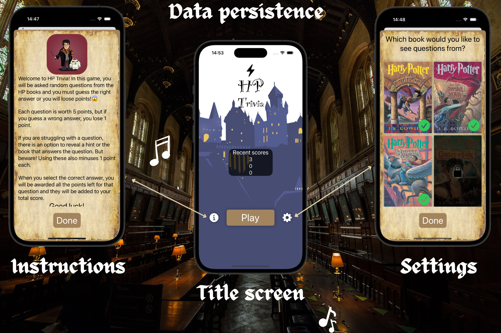
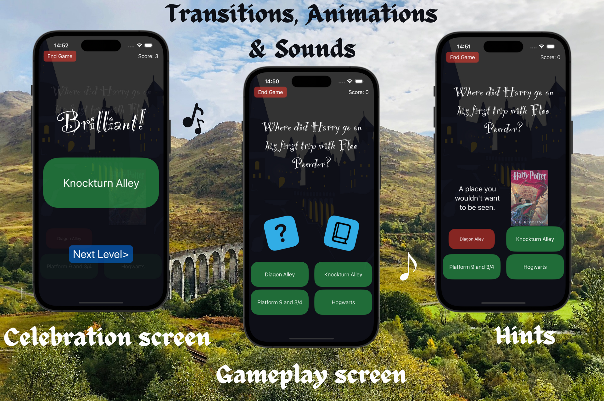
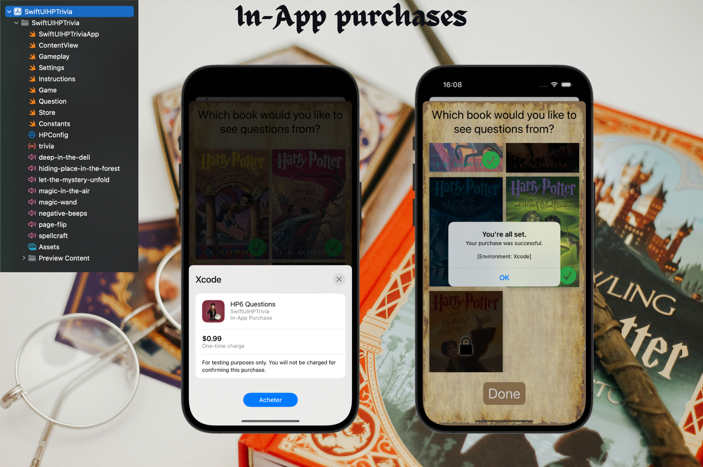

# HP Trivia

## Description

The HP Trivia App is a SwiftUI application that quizzes users on Harry Potter book series trivia questions, providing an interactive and engaging experience for fans of the wizarding world.

## Features

- **Book Selection**: Users can choose which Harry Potter books to include in the trivia questions.
- **Question Display**: Displays trivia questions from selected books with multiple-choice answers.
- **Score Tracking**: Tracks users' scores based on correct answers and penalties for wrong answers or hints.
- **Hint System**: Offers hints or book references to assist users with difficult questions at a cost of score penalties.
- **Animations & Transitions**: Utilizes SwiftUI animations to bring the trivia game to life, with transitions between questions and interactive elements that respond to user interactions.
- **Immersive Experience**: Enhances the user experience with background music inspired by the Harry Potter series, creating an immersive atmosphere during gameplay.
- **In-App Purchases**: Utilizes a custom HP configuration file to manage in-app purchases for unlocking additional Harry Potter books beyond the initially available ones, enhancing the user's selection of trivia content.
- **Data Persistence**: Saves book selection and user preferences using the HP configuration file, ensuring that settings are retained even after the app is closed.

## Stretch Goals

- **iOS17**: This project will be updated to iOS17.

## Technologies Used

- Background Music: Utilizes audio playback features in SwiftUI to integrate background music that complements the Harry Potter theme.
- **SwiftUI**: A modern framework for building user interfaces across all Apple platforms.
- **Xcode**: An integrated development environment (IDE) for macOS containing a suite of software development tools.
- **Swift**: A powerful and intuitive programming language for macOS, iOS, watchOS, and tvOS development.

## Credits

- This project is a tutorial from Kenneth Jones' [UDEMY Course](https://www.udemy.com/course/ios-15-app-development-with-swiftui-3-and-swift-5/): "iOS 17, SwiftUI 5, & Swift 5.9: Build iOS Apps From Scratch".
- Original project idea and design by Kenneth Jones.

## Author

- [alcode111](https://github.com/alcode111)
